title: Geometria 1
theme: _pres_theme

--

# Geometria 1
## $\times$ ALL THE THINGS!

--

### Body: Napríklad takto

```cpp
template <typename Number>
class Point {
public:
    Number x, y;
    Point<Number>(Number _x = 0, Number _y = 0) {
        x = _x;
        y = _y;
    }
    bool operator==(const Point<Number>& p2) const { return x == p2.x && y == p2.y; }
    bool operator!=(const Point<Number>& p2) const { return x != p2.x || y != p2.y; }
    void operator+=(const Point<Number>& p2) { x += p2.x; y += p2.y; }
    void operator-=(const Point<Number>& p2) { x -= p2.x; y -= p2.y; }
    Point<Number> operator+ (const Point<Number>& p2) { return Point<Number>(x + p2.x, y + p2.y); }
    Point<Number> operator- (const Point<Number>& p2) { return Point<Number>(x - p2.x, y - p2.y); }
};
template <typename Number>
double dist(const Point<Number>& p1, const Point<Number>& p2) { return sqrt((p1.x - p2.x)*(p1.x - p2.x) + (p1.y - p2.y)*(p1.y - p2.y)); }

template <typename Number>
ostream& operator<<(ostream& os, const Point<Number>& p) { return os << "[" << p.x << "," << p.y << "]"; }
```
--

### Body: Napríklad takto

```cpp
template <typename Number>
class Point {
public:
    Number x, y;
    Point<Number>(Number _x = 0, Number _y = 0) {
        x = _x;
        y = _y;
    }
    bool operator==(const Point<Number>& p2) const { return x == p2.x && y == p2.y; }
    bool operator!=(const Point<Number>& p2) const { return x != p2.x || y != p2.y; }
    void operator+=(const Point<Number>& p2) { x += p2.x; y += p2.y; }
    void operator-=(const Point<Number>& p2) { x -= p2.x; y -= p2.y; }
    Point<Number> operator+ (const Point<Number>& p2) { return Point<Number>(x + p2.x, y + p2.y); }
    Point<Number> operator- (const Point<Number>& p2) { return Point<Number>(x - p2.x, y - p2.y); }
};
template <typename Number>
double dist(const Point<Number>& p1, const Point<Number>& p2) { return sqrt((p1.x - p2.x)*(p1.x - p2.x) + (p1.y - p2.y)*(p1.y - p2.y)); }

template <typename Number>
ostream& operator<<(ostream& os, const Point<Number>& p) { return os << "[" << p.x << "," << p.y << "]"; }
```
<div style="position: absolute; top: 0; width: 100%; text-align: center; color: red; font-size: 15em">×</div>

--

### Body: Alebo takto!

temný trik: `<complex>` to the rescue!

```cpp
#include <complex>
#define X real
#define Y imag
typedef complex<long long int> P;
```
```cpp
P a(0,0); P b; b.X(1); b.Y(1);

abs(a - b);  // $\leftarrow \sqrt 2$
// :-)
```
--

### Vpravo, vľavo

*Liaheň:* Deti na lúke

Keď sa <span style="color: #f00">Olívia</span> pozerá na <span style="color: #f0f">Bašku</span>, je <span style="color: #090">Žaba</span> po jej pravej alebo ľavej ruke?

--

### Vpravo, vľavo

**možné riešenie:** $f\colon y = ax + b$, pýtame sa, či je bod nad alebo pod $f$

fuj, bleee: special cases, čo so zvislými priamkami a pod...


:-(

--
### Vpravo, vľavo
<small style="font-size: 0.6em">
```cpp
#include <stdio.h>

int main() {
  int t, i;
  int ax, ay, bx, by, cx, cy, y; /* suradnice Adamka, Betky a Cilky */

  scanf("%d", &t);

  for (i = 0; i < t; i++) {
    scanf("%d %d %d %d %d %d", &ax, &ay, &bx, &by, &cx, &cy);

    /* Posuvam zaciatok suradnic do polohy Adamka pre zjednodusenie */
    bx -= ax;
    by -= ay;
    cx -= ax;
    cy -= ay;
    ax = ay = 0;

    /* ked je B presne nad alebo pod A, tak to nie je funkcia, a dole by som 
       delila nulou, takze tento pripad riesim zvlast */
    if (bx == 0) {
      if (cx == 0)
    printf("rovno\n");
      else
    if ((by > 0 && cx < 0) || (by < 0 && cx > 0))
      printf("vlavo\n");
    else
      printf("vpravo\n");
    }
    else {
      /* Ak je Cilka na jednej priamke s A. a B., a jej x-ova suradnica je cx,
     potom jej y-ova suradnica musi byt a*cx, kde a = by/bx. */
      if (cy*bx == by*cx)
    printf("rovno\n");
      else
    if ((bx*cy > by*cx && bx > 0) || (bx*cy > by*cx && bx < 0)) /* Tie podmienky vidno, */
      printf("vlavo\n");                     /* ked si to clovek nakresli */
    else
      printf("vpravo\n");
    }
  }

  return 0;
}
```
</small>
--

### Vpravo, vľavo


**lepšie riešenie:**
```cpp
int main (){
  int ax, ay, bx, by, cx, cy;
  scanf("%d %d %d %d %d %d ",&ax,&ay,&bx,&by,&cx,&cy);

  int ux = bx-ax, uy = by-ay;
  int vx = cx-ax, vy = cy-ay;
  int res = ux*vy - uy*vx;

  if (res == 0) printf("rovno\n");
  if (res < 0)  printf("vpravo\n");
  if (res > 0)  printf("vlavo\n");

  return 0;
}
```

<p style="text-align: center">...wat?</p>

--
### Vektorový súčin

--
### Vektorový súčin

--
### Vektorový súčin

definovaný pre 3-rozmerné vektory
--
### Vektorový súčin
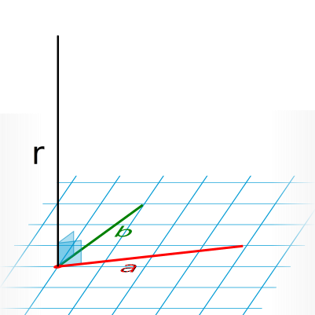
$r = a\times b$

$r_x = a_y b_z - a_z b_y$
$r_y = a_z b_x - a_x b_z$
$r_z = a_x b_y - a_y b_x$

- $r$ je kolmý na pôvodné vektory
- „väčší ak sú menej rovnakým smerom”

--
### Vektorový súčin

$r = a\times b$

$r_x = a_y b_z - a_z b_y$
$r_y = a_z b_x - a_x b_z$
$r_z = a_x b_y - a_y b_x$

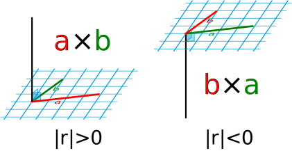

--

### Vpravo, vľavo


```cpp
int main (){
  int ax, ay, bx, by, cx, cy;
  scanf("%d %d %d %d %d %d ",&ax,&ay,&bx,&by,&cx,&cy);

  int ux = bx-ax, uy = by-ay;
  int vx = cx-ax, vy = cy-ay;
  int res = ux*vy - uy*vx;

  if (res == 0) printf("rovno\n");
  if (res < 0)  printf("vpravo\n");
  if (res > 0)  printf("vlavo\n");

  return 0;
}
```

$a_z = b_z = 0 \Rightarrow |r| = r_z$

--

### Vpravo, vľavo


```cpp
int main (){
  int ax, ay, bx, by, cx, cy;
  scanf("%d %d %d %d %d %d ",&ax,&ay,&bx,&by,&cx,&cy);

  int ux = bx-ax, uy = by-ay;
  int vx = cx-ax, vy = cy-ay;
  int res = ux*vy - uy*vx;

  if (res == 0) printf("rovno\n");
  if (res < 0)  printf("vpravo\n");
  if (res > 0)  printf("vlavo\n");

  return 0;
}
```

$a_z = b_z = 0 \Rightarrow |r| = r_z$ ✓

--

### Vpravo, vľavo: pretínajú sa 2 úsečky?
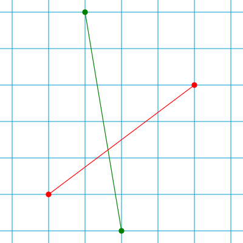
--
### Vpravo, vľavo: pretínajú sa 2 úsečky?
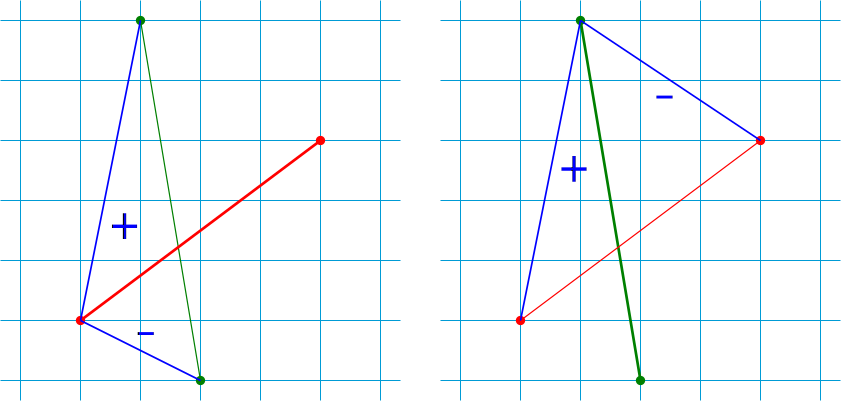
--
### Vpravo, vľavo: pretínajú sa 2 úsečky?
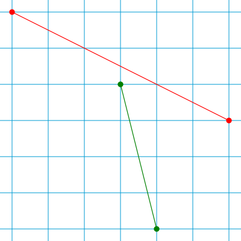
--
### Vpravo, vľavo: pretínajú sa 2 úsečky?

--

### Vektorový súčin
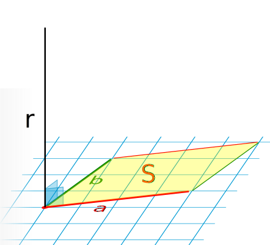
$r = a\times b$

$r_x = a_y b_z - a_z b_y$
$r_y = a_z b_x - a_x b_z$
$r_z = a_x b_y - a_y b_x$

- $|r| = |a||b| \sin \alpha$  
  ⇒ $S = |r|$

--
### Obsah $n$-uholníka
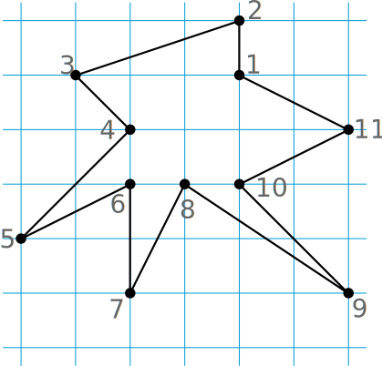
--
### Obsah $n$-uholníka
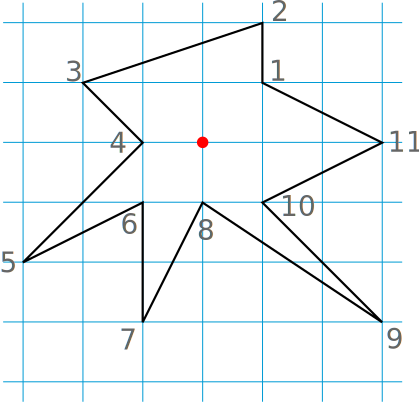
--
### Obsah $n$-uholníka
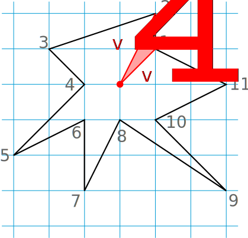
$S_{12} = \frac{|v_1 \times v_2|}{2}$
--
### Obsah $n$-uholníka
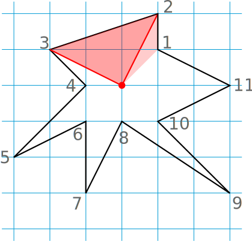
$S_{23} = \frac{|v_2 \times v_3|}{2}$
--
### Obsah $n$-uholníka

$ S = $
$\frac{|v\_1 \times v\_2|}{2}$
$+$
$\frac{|v\_2 \times v\_3|}{2}$
$+$
$\ldots$
$+$
$\frac{|v\_{n-1} \times v\_n|}{2}$
$+$
$\frac{|v\_n \times v\_1|}{2}$
--
### Obsah $n$-uholníka
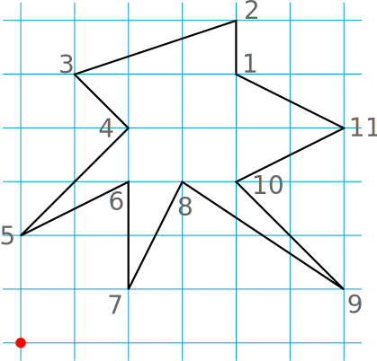
Čo ak si zvolíme menej dobrý bod, alebo je $n$-uholník nekonvexnejší, alebo čosi také?
--
### Obsah $n$-uholníka
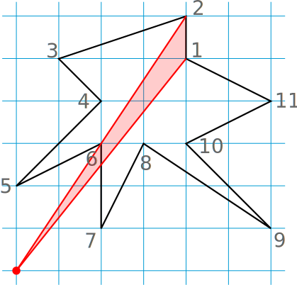
--
### Obsah $n$-uholníka

--
### Obsah $n$-uholníka
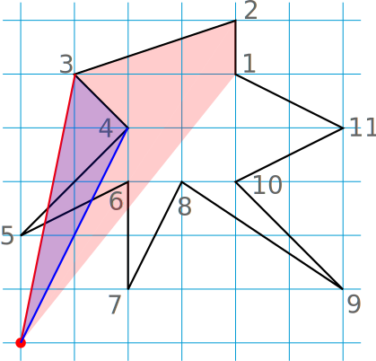
$v_4$ je „na zlej strane” ⇒ $|v_3 \times v_4|$ bude záporné
--
### Obsah $n$-uholníka
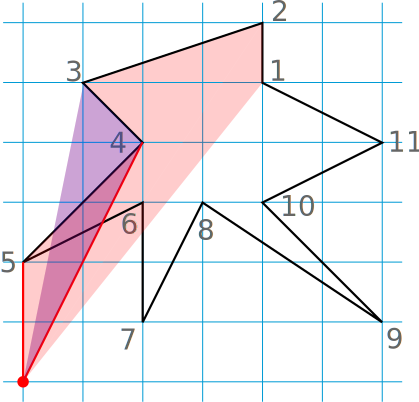
--
### Obsah $n$-uholníka
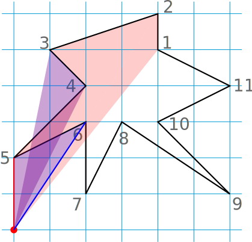
--
### Obsah $n$-uholníka

--
### Obsah $n$-uholníka
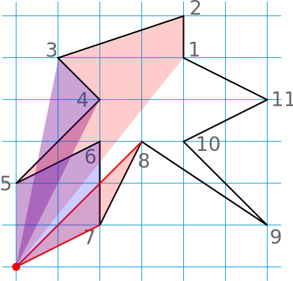
--
### Obsah $n$-uholníka

--
### Obsah $n$-uholníka
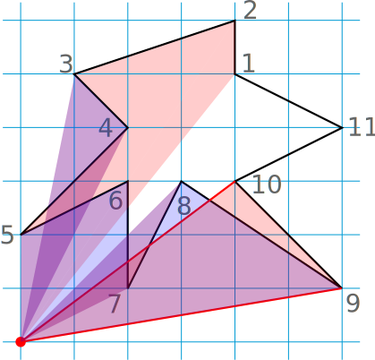
--
### Obsah $n$-uholníka
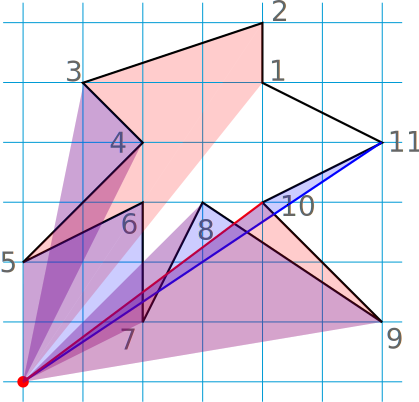
--
### Obsah $n$-uholníka
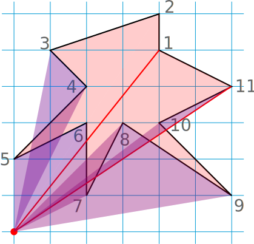
--
### Obsah $n$-uholníka
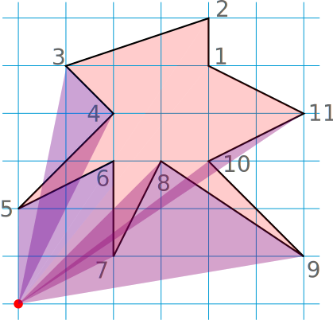
:-)
--
### Obsah $n$-uholníka

:-)

<p style="color: #aaa"><i>pozn.:</i> ak S < 0, $n$-uholník je zadávaný po smere hod. ručičiek</p>

--

### Konvexný obal
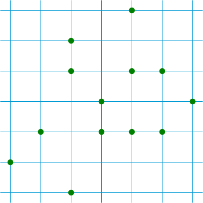
Akým najkratším plotom viem ohradiť tieto stromy?  
--
### Konvexný obal

<span style="color: #aaa">Akým najkratším plotom viem ohradiť tieto stromy?</span>  
Takým, ako by vyzerala gumička natiahnutá okolo všetkých tých bodov.
--
### Konvexný obal: konštrukcia
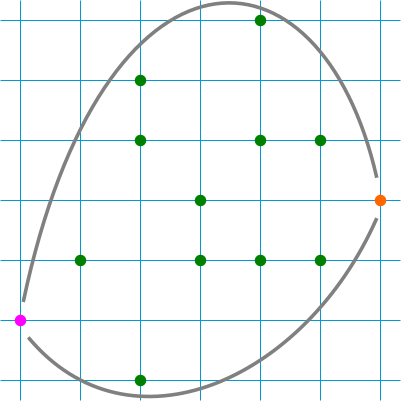
- $O(N^2)$
- $O(N \log N)$
--
### Konvexný obal: konštrukcia

- hornú a dolnú polovicu zvlášť (najľavší a najpravší bod)
- zametanie: body spracúvame v poradí podľa $x$-ovej súradnice  
  $\rightarrow$
--
### Konvexný obal: konštrukcia

- hornú a dolnú polovicu zvlášť (najľavší a najpravší bod)
- zametanie: body spracúvame v poradí podľa $x$-ovej súradnice  
  $\rightarrow$
--
### Konvexný obal: konštrukcia

--
### Konvexný obal: konštrukcia

dolný polobal je zatiaľ konvexný, všetko je OK
--
### Konvexný obal: konštrukcia
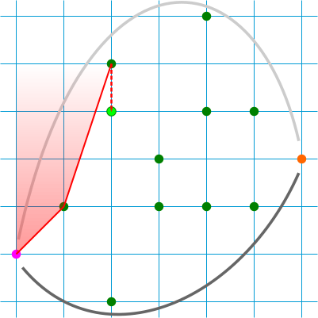
tu to je zrazu zle (nekonvexné)
--
### Konvexný obal: konštrukcia
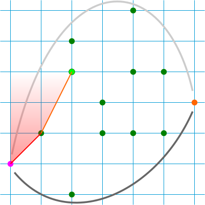
kým to je zle, skonvexňujeme vyhadzovaním predposledného bodu
--
### Konvexný obal: konštrukcia

--
### Konvexný obal: konštrukcia
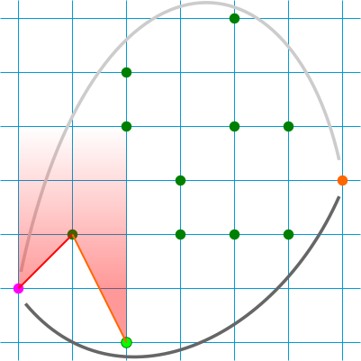
--
### Konvexný obal: konštrukcia
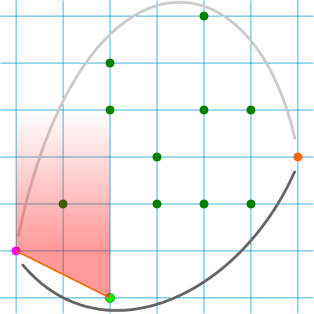
--
### Konvexný obal: konštrukcia
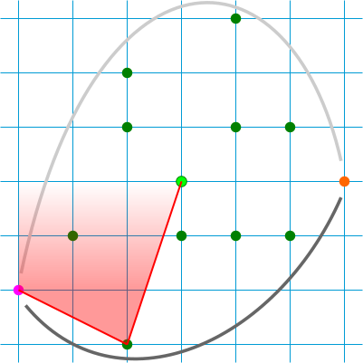
--
### Konvexný obal: konštrukcia

--
### Konvexný obal: konštrukcia

--
### Konvexný obal: konštrukcia
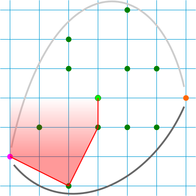
--
### Konvexný obal: konštrukcia
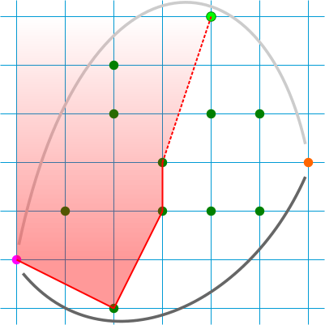
--
### Konvexný obal: konštrukcia

--
### Konvexný obal: konštrukcia

--
### Konvexný obal: konštrukcia
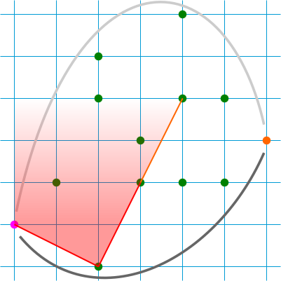
--
### Konvexný obal: konštrukcia

--
### Konvexný obal: konštrukcia

--
### Konvexný obal: konštrukcia

--
### Konvexný obal: konštrukcia

--
### Konvexný obal: konštrukcia

atď.
--
### Konvexný obal: konštrukcia
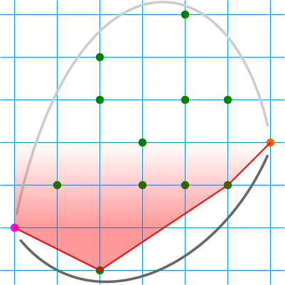
--
### Konvexný obal: konštrukcia

--
### Konvexný obal: konštrukcia
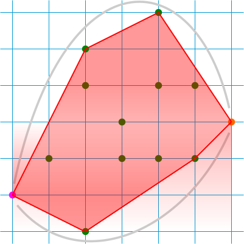

:-)
--


### odtialto to je TODO
- convex hull
- maybe line intersection?
